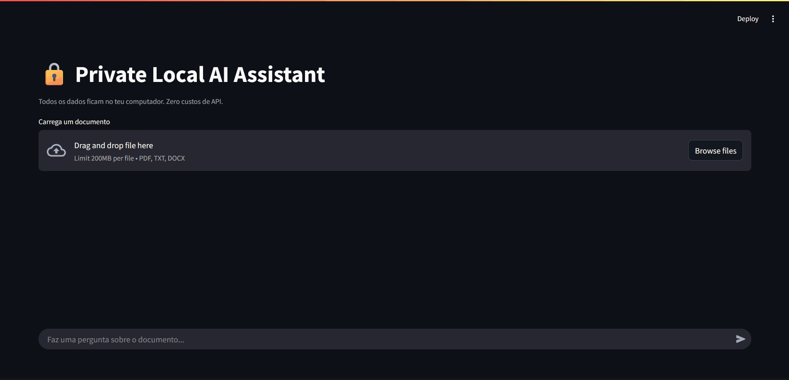

# Private Local AI Assistant
> AI que responde perguntas sobre os teus documentos — 100% local, zero custos de API, RGPD compliant.



## Por que Local AI?

| | OpenAI API | Este projeto |
|---|---|---|
| Custo mensal | €50-200/mês | €0 após instalação |
| Dados saem da empresa | Sim | Nunca |
| Funciona offline | Não | Sim |
| RGPD compliant | Risco | 100% |

## Stack técnica
- Python 3.11+ · Ollama · Phi-3 Mini (3.8B)
- LangChain · ChromaDB · Streamlit
- Custo total: €0

## Instalação em 5 comandos
```bash
git clone https://github.com/artiomgusanu/private-local-ai
cd private-local-ai
python -m venv venv && venv\Scripts\activate
pip install -r requirements.txt
python -m streamlit run src/app.py
```

## Casos de uso reais
- **Clínicas** — pesquisa em fichas de pacientes sem enviar dados para fora
- **Escritórios de advogados** — análise de contratos com privacidade total
- **Contabilistas** — consulta de documentos fiscais internamente
- **PMEs** — base de conhecimento interna sem subscrições mensais

## Hire me
Precisas de um sistema de IA privado para a tua empresa?

- LinkedIn: [https://www.linkedin.com/in/artiomgusanu/]
- Email: [artiomgusanu@hotmail.com]